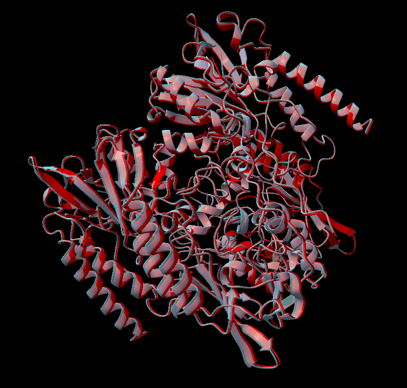

## Current state of af3-neutrons

Correctly recreate original af3 output even with diffusion overhead and no experimental data passed

Next up:
* recreate af3 output with exp data passed and placeholder loss
* place exp data hydrogens without any fancy loss
* custom loss to handle exp data hydrogens
